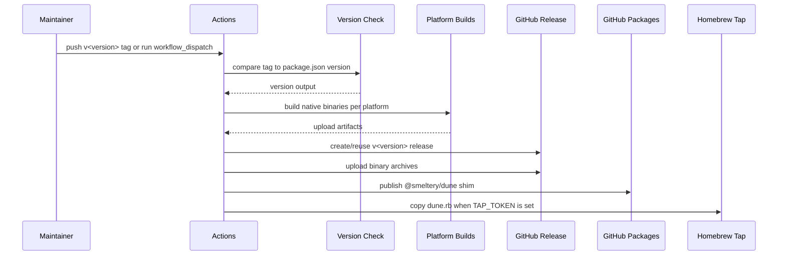
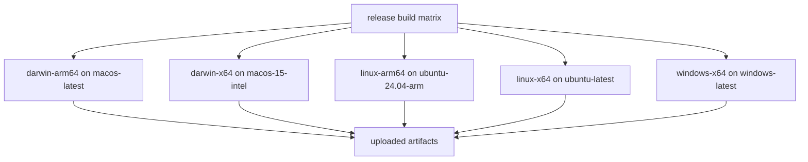

# Releasing

Releases publish a small GitHub Packages shim and GitHub release archives containing the real platform binaries. The package does not contain every binary. Instead, install-time launcher code downloads the matching binary from the GitHub release for the package version. That means release ordering matters: binaries must exist on GitHub before package users can install the published version successfully.

## Release Flow



`package.json` is the version source. A tag push must match `v${package.json.version}`. If it does not, the workflow fails before building.

## Release Workflow Jobs

| Job       | Purpose                                                                                                                                                 |
| --------- | ------------------------------------------------------------------------------------------------------------------------------------------------------- |
| `check`   | Reads `package.json`, validates the tag when the workflow was triggered by a tag push, and exposes the version to later jobs.                           |
| `build`   | Builds native binaries on host runners that match the target platform family and uploads artifacts.                                                     |
| `publish` | Downloads artifacts, normalizes the `dist/` layout, creates or reuses the GitHub release, uploads binaries and Homebrew assets, then publishes package. |
| `tap`     | Copies the release's generated `dune.rb` into `smeltery/homebrew-tap` as `Formula/dune.rb` when `TAP_TOKEN` is configured.                             |

## Platform Matrix

The release workflow builds on one runner per target family because optional native packages are installed according to the host platform.

| Target         | Runner             |
| -------------- | ------------------ |
| `darwin-arm64` | `macos-latest`     |
| `darwin-x64`   | `macos-15-intel`   |
| `linux-arm64`  | `ubuntu-24.04-arm` |
| `linux-x64`    | `ubuntu-latest`    |
| `windows-x64`  | `windows-latest`   |



## Ordering Invariants

The release workflow has several invariants that should not be weakened:

| Invariant                                              | Reason                                                                                          |
| ------------------------------------------------------ | ----------------------------------------------------------------------------------------------- |
| Validate tag/version before building.                  | A mismatched tag would publish assets under one version while the package shim fetches another. |
| Build on matching platform runners.                    | Optional OpenTUI native packages are host-specific.                                             |
| Upload GitHub release binaries before package publish. | The package fetches binaries from the GitHub release.                                           |
| Publish only to GitHub Packages with public access.    | `GITHUB_TOKEN` can publish the scoped package for this repository without npmjs secrets.        |
| Copy the formula from the release asset.               | The formula must stay checksummed against the exact archives and bottles uploaded for the tag.  |
| Let the tap job skip cleanly without `TAP_TOKEN`.      | Missing tap credentials should leave Homebrew stale, not fail every other release channel.      |
| Reuse existing tags instead of moving them.            | Re-running a release should not rewrite published version history.                              |

## Manual Release Checklist

Before starting a release:

1. Confirm `main` is green in CI.
2. Confirm `package.json` has the intended version.
3. Confirm `CHANGELOG` or release notes source is ready if one is being maintained.
4. Confirm the workflow still has `packages: write` permission.
5. Confirm `TAP_TOKEN` is configured if this release should update `smeltery/homebrew-tap`.
6. Confirm the license is still the intended PolyForm Shield license text.

Trigger release by either pushing the matching tag or using `workflow_dispatch`.

```bash
git tag v$(node -p "require('./package.json').version")
git push origin v$(node -p "require('./package.json').version")
```

## Local Smoke

Local smoke checks do not replace the release workflow because they cannot build every platform from one host. They are still useful before tagging.

```bash
flox activate
bun install
bun run check-types
bun run lint
bun run budget
bun run test:ci
bun run build
```

Use `bun run release` locally only when inspecting the staged release output. Publishing should happen through GitHub Actions so package authentication, artifacts, and tags are handled consistently.

## Failure Recovery

| Failure point                                       | Recovery                                                                                  |
| --------------------------------------------------- | ----------------------------------------------------------------------------------------- |
| Version check fails                                 | Fix `package.json` version or push the correct tag. Do not publish from a mismatched tag. |
| One platform build fails                            | Fix the target-specific build issue and re-run the workflow.                              |
| Release upload fails                                | Re-run after confirming the tag exists and `contents: write` permission is available.     |
| Package publish fails before a package is published | Fix GitHub Packages permissions and re-run.                                               |
| Tap publish is skipped                              | Add `TAP_TOKEN`, or copy `dune.rb` from the release to `smeltery/homebrew-tap` by hand.  |
| Package version already exists                      | Treat the package version as immutable; bump version for any content change.              |

If GitHub release assets were uploaded but package publication failed, do not delete or move the tag unless the version was never meant to ship. Fix GitHub Packages publication and re-run the same workflow so the package points at the already-correct release assets.

## License

The repository uses the same license text as `smeltery/hab`: PolyForm Shield License 1.0.0 with copyright assigned to smeltery. Release artifacts and package metadata must continue to identify the package as `PolyForm-Shield-1.0.0`.
